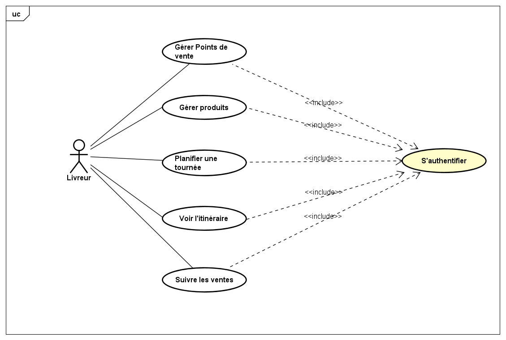
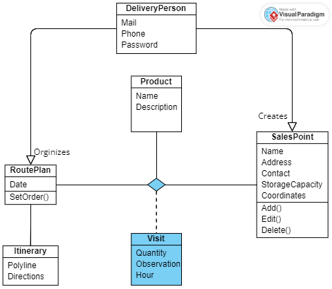

# DeliveryApp

## Context

A delivery person wishes to have a mobile application to:

- Manage the points of sale they visit.
- Plan their delivery routes (itineraries).
- Record data from visits and sales.
- Track routes between their GPS position and the points of sale.

---

## Objectives

The goal is to create a Flutter application that allows the delivery person to:

1. Manage their points of sale (add, modify, delete).
2. Plan their delivery route.
3. Record sales and notes after each visit.
4. Visualize itineraries and navigate through planned routes.

---

## Expected Features

### 1. Authentication
- A login page to secure access to the application.

### 2. Management of Points of Sale
The delivery person can manage their points of sale:
- Add a point of sale with:
    - Name of the point of sale.
    - Address.
    - Contact details (name and phone number).
    - Storage capacity.
    - GPS coordinates.
- Modify or delete a point of sale.

### 3. Route Planning
- The delivery person can select the points of sale they plan to visit for a given day.
- The order of visits can be organized by the delivery person.

### 4. Geolocation and Itinerary
- Display all points of sale on an interactive map.
- Show the route between the delivery person’s current GPS position and the selected points of sale in the itinerary.
- The itinerary is downloaded via the OpenRouteService API and saved in the database for offline viewing.

### 5. Sales Tracking
- After each visit, the delivery person records the following data:
    - Quantity sold.
    - Observations or notes.
    - Time of the visit.

---

## Technologies Used

- **Flutter**: Application development.
- **SQLite**: Local data storage.
- **Flutter Map**: Interactive map for geolocation and navigation.
- **OpenRouteService API**: For route planning and navigation.

---

## UseCase Diagram

Below is the UseCase diagram that represents the main functions of the system:




## Class Diagram

Below is the class diagram that represents the structure and relationships of the system:




### Explanation of the Diagram

1. **DeliveryPerson**:
    - Represents the user of the application (delivery person).
    - Attributes: `Mail`, `Phone`, and `Password` for authentication and communication.

2. **SalesPoint**:
    - Represents the points of sale managed by the delivery person.
    - Attributes: `Name`, `Address`, `Contact`, `StorageCapacity`, and `Coordinates`.
    - Methods:
        - `Add()`: Add a new point of sale.
        - `Edit()`: Edit existing details.
        - `Delete()`: Remove a point of sale.

3. **RoutePlan**:
    - Represents the daily delivery plan.
    - Attributes: `Date` and the sequence of visits.
    - Methods:
        - `SetOrder()`: Define the sequence of visits.
    - Relationship: Organizes multiple `SalesPoint` entities.

4. **Itinerary**:
    - Represents the route information.
    - Attributes: `Polyline`, `Distance`, `EstimatedTime`, and `Geometry`.

5. **Visit**:
    - Tracks details of each visit to a sales point.
    - Attributes: `Quantity` (sold), `Observation` (notes), `Hour` (time of visit), and `SalesPoint`.
    - Relationship: Links `DeliveryPerson` and `SalesPoint` through recorded visits.

6. **Product**:
    - Represents the items being sold.
    - Attributes: `Name`, `Description`, and `Price`.
    - Relationship: Used within `Visit` for sales recording.

---


## Installation and Setup
1. **Clone the Repository**:
```bash
git clone https://github.com/SOUKA-ina-2002/deliveryApp.git
cd DeliveryApp
```

2. **Install Dependencies**:
Ensure you have Flutter installed. Then run:
```bash
flutter pub get
 ```

3. **Run the Application**:
 ```bash
flutter run
 ```

4. **Database Setup**:
SQLite is used for local storage. The database schema is auto-generated on first launch.

---